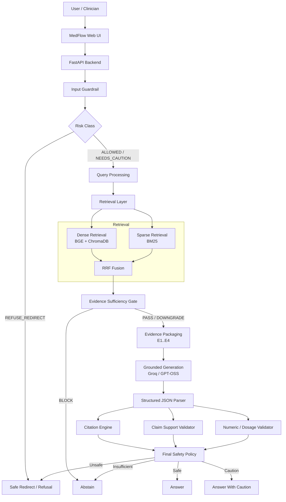
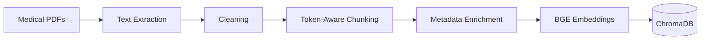
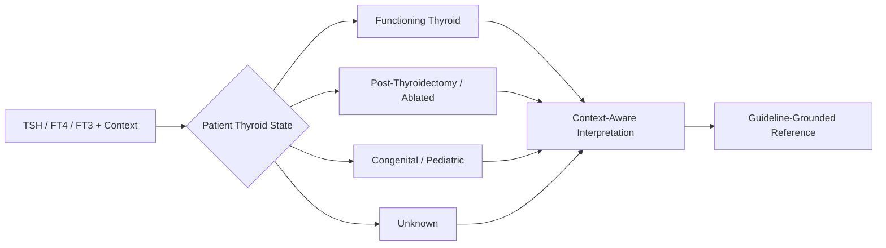
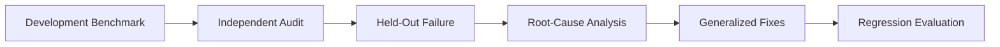

<div align="center">

# MedFlow
### Evidence-Grounded Thyroid Clinical AI Platform

**Clinical RAG • Verifiable Citations • Safety Guardrails • Lab Interpretation • PDF Intelligence**

[](https://www.python.org/)
[](https://fastapi.tiangolo.com/)
[](https://www.trychroma.com/)
[](#system-architecture)
[](#clinical-scope)
[](#project-status)

> **The LLM draft is not the final answer.**  
> MedFlow retrieves evidence, generates under evidence constraints, verifies claims and citations, checks high-risk numeric details, then decides whether to **answer, caution, abstain, or redirect**.

### 🌐 Interactive Project Portfolio
**https://nadaakhatab.github.io/medflow/**

</div>

---

## Table of Contents

- [Overview](#overview)
- [Why MedFlow](#why-medflow)
- [Core Features](#core-features)
- [System Architecture](#system-architecture)
- [Retrieval Architecture](#retrieval-architecture)
- [Grounded Generation](#grounded-generation)
- [Safety Architecture](#safety-architecture)
- [Clinical Workspace](#clinical-workspace)
- [Evaluation & Benchmarks](#evaluation--benchmarks)
- [Technology Stack](#technology-stack)
- [Project Structure](#project-structure)
- [Quick Start](#quick-start)
- [API](#api)
- [Future Roadmap](#future-roadmap)
- [Team](#team)
- [Disclaimer](#disclaimer)

---

# Overview

**MedFlow** is a specialized thyroid clinical AI platform designed around one principle:

> **A fluent medical answer is not automatically a safe or evidence-supported answer.**

The platform combines:

- Retrieval-Augmented Generation (**RAG**)
- source-grounded clinical responses
- page-level and chunk-level citation traceability
- thyroid-specific knowledge workflows
- patient-context-aware lab interpretation
- semantic PDF search and ingestion
- structured generation
- claim-level evidence validation
- numeric / dosage safety checks
- prompt-injection and out-of-scope guardrails

MedFlow is intentionally **not** an unrestricted general medical chatbot. It is a domain-focused clinical AI prototype for thyroid evidence retrieval and decision-support workflows.

---

# Why MedFlow

Traditional LLM applications often follow:

```text
Question → LLM → Answer
```

MedFlow uses a controlled clinical pipeline:

```text
Question
   ↓
Risk Classification
   ↓
Evidence Retrieval
   ↓
Evidence Sufficiency
   ↓
Grounded Generation
   ↓
Citation Resolution
   ↓
Claim Validation
   ↓
Numeric Safety Validation
   ↓
Final Safety Policy
   ↓
ANSWER / CAUTION / ABSTAIN / REDIRECT
```

### The key difference

A valid-looking citation does **not** automatically mean the claim is supported.

MedFlow separates:

```text
Citation ID validity
        ≠
Citation metadata resolution
        ≠
Claim-to-evidence support
        ≠
Clinical correctness
```

That separation is one of the strongest architectural decisions in the project.

---

# Core Features

| Feature | What it does |
|---|---|
| **Evidence-Grounded RAG Chat** | Answers thyroid questions using retrieved clinical evidence |
| **Page-Level Citations** | Traces responses to document, page, section, and chunk |
| **Source Verification Panel** | Lets users inspect the exact retrieved evidence |
| **Knowledge Base** | Structured summaries of major thyroid diseases |
| **Disease Matrix** | Side-by-side clinical comparison of thyroid conditions |
| **Lab Interpreter** | Context-aware interpretation for different thyroid states |
| **PDF Vector Search** | Semantic search across curated and uploaded documents |
| **Dynamic PDF Ingestion** | Upload, process, index, and search new medical PDFs |
| **Safety Guardrails** | Detects unsafe, out-of-scope, and adversarial requests |
| **Claim Validator** | Labels claims as SUPPORTED / UNSUPPORTED / REVIEW_REQUIRED |
| **Numeric Safety Layer** | Checks doses, units, thresholds, durations, and numeric claims |
| **Interactive RAG Architecture View** | Shows how evidence flows through the system |
| **3D Project Portfolio** | Judge/management-facing project showcase under `docs/` |

---

# System Architecture

## High-Level Production Architecture



---

## Offline Evidence Pipeline



Each indexed evidence unit can preserve:

```text
Document Name
Section
Page Number
Chunk ID
Source Tier
Retrieval Rank
Retrieval Score
```

---

## Clinical Lab Interpretation Path



---

# Retrieval Architecture

MedFlow contains two related retrieval views and they are deliberately documented separately.

## 1. Frozen Day 2 Benchmark Core

This is the configuration used for the canonical measured retrieval metrics:

```text
Embedding Model : BAAI/bge-small-en-v1.5
Dimensions      : 384
Normalization   : Yes
Similarity      : Cosine
Chunk Size      : 200 tokens
Overlap         : 0
Top-K           : 4
Indexed Chunks  : 1,470
Reranker        : Disabled
```

Query instruction:

```text
Represent this sentence for searching relevant passages:
```

## 2. Product Hybrid Retrieval Path

The product/web architecture also exposes a hybrid retrieval pipeline:

```text
Dense Retrieval (BGE + ChromaDB)
          +
Sparse Retrieval (BM25)
          ↓
Reciprocal Rank Fusion (RRF)
          ↓
Unified Candidate Ranking
```

The hybrid path is part of the product architecture.

**Important:** the frozen Day 2 metrics below belong to the benchmarked retrieval configuration and should not be presented as hybrid-RRF benchmark results unless the hybrid stack is separately evaluated.

---

# Retrieval Experiments

## Embedding Models

| Model | Dimensions | Outcome |
|---|---:|---|
| `all-MiniLM-L6-v2` | 384 | Fast baseline |
| `all-mpnet-base-v2` | 768 | Strong but slower |
| `BAAI/bge-small-en-v1.5` | 384 | **Selected** |

BGE-small was selected because it gave a strong overall balance across:

- Hit@1
- MRR
- passage retrieval quality
- compact embedding size
- practical CPU query latency

---

## Chunking Experiments

| Configuration | Outcome |
|---|---|
| **200 tokens / 0 overlap** | **Selected** |
| 400 tokens / 50 overlap | Lower passage precision |
| 600 tokens / 100 overlap | More context noise |
| 500-character naive chunks | Baseline |

---

## Top-K Selection

| K | Precision@K | Hit@K |
|---:|---:|---:|
| 3 | ~54.17% | ~81.25% |
| **4** | **53.12%** | **87.50%** |
| 5 | 50.00% | 87.50% |

**Why K=4?**

K=4 increased evidence coverage compared with K=3, while K=5 introduced additional context noise without improving Hit@K.

---

## Reranker Experiment

Tested:

```text
cross-encoder/ms-marco-MiniLM-L-6-v2
```

The reranker was **not retained** because the tested configuration reduced retrieval quality and added significant latency.

> MedFlow includes components because measurement shows they help — not because they sound sophisticated.

---

# Grounded Generation

## Active Day 3 Generation Configuration

```text
Provider    : Groq Cloud API
Model       : openai/gpt-oss-120b
Temperature : 0.0
```

Retrieved evidence is packaged deterministically:

```text
[E1]
[E2]
[E3]
[E4]
```

The generation model is instructed to treat retrieved evidence as the clinical source of truth.

### Structured Response Contract

```json
{
  "answer": "Grounded answer [E1]",
  "claims": [
    {
      "text": "Clinical claim",
      "evidence_ids": ["E1"]
    }
  ],
  "evidence_status": "HIGH",
  "limitations": "..."
}
```

The LLM is **not** responsible for inventing final citation metadata.

The citation engine resolves evidence IDs back to:

```text
Document
Section
Page
Chunk ID
```

---

# Safety Architecture

## Input Risk Classes

```text
ALLOWED
NEEDS_CAUTION
REFUSE_REDIRECT
```

## Evidence Gate States

```text
PASS
DOWNGRADE
BLOCK
N/A_INTERCEPTED
```

## Claim Validation States

```text
SUPPORTED
UNSUPPORTED
REVIEW_REQUIRED
```

## Final Actions

```text
ANSWER
ANSWER_WITH_CAUTION
ABSTAIN
REDIRECT
```

---

## Safety Layer Responsibilities

| Layer | Responsibility |
|---|---|
| **Input Guardrail** | Detects injection, unsafe dosage intent, OOS queries, and patient-specific context |
| **Risk Classifier** | Routes requests into allowed, caution, or refusal behavior |
| **Evidence Gate** | Checks whether retrieval is sufficient for the requested level of detail |
| **Citation Engine** | Resolves evidence IDs to deterministic source metadata |
| **Claim Validator** | Checks whether each claim is supported by cited evidence |
| **Numeric Validator** | Adds stricter checking for units, doses, thresholds, and numbers |
| **Safety Policy** | Decides whether to answer, caution, abstain, or redirect |

---

# Numeric & Dosage Safety

Medical numbers are treated as high-risk details.

Examples:

```text
7.2 ≠ 7
20 mg ≠ 20%
5 weeks ≠ 5 mg
1.5 mg/kg ≠ 1.5 mg
```

The validator is designed to inspect:

- medication quantities
- dosage units
- percentages
- ages
- durations
- lab thresholds
- ranges
- numeric claims

---

# Clinical Workspace

The web application includes:

| Module | Purpose |
|---|---|
| **Home** | Project overview and fast entry into MedFlow |
| **RAG Chat** | Evidence-grounded thyroid Q&A |
| **Knowledge Base** | Structured thyroid disease summaries |
| **Disease Matrix** | Side-by-side condition comparison |
| **Lab Interpreter** | Context-aware thyroid lab assessment |
| **PDF Search** | Semantic search across indexed documents |
| **RAG Architecture** | Transparent visual explanation of the pipeline |

---

# Clinical Scope

The current evidence corpus and evaluation focus on thyroid medicine.

Supported areas include:

- Hypothyroidism
- Hashimoto's thyroiditis
- Hyperthyroidism
- Graves' disease
- Thyroid nodules
- Differentiated thyroid cancer
- Thyroid evaluation
- Thyroid surveillance
- General thyroid guideline questions

MedFlow is intentionally **not** an unrestricted general medical chatbot.

---

# Evaluation & Benchmarks

## Day 2 — Canonical Retrieval Metrics

The canonical benchmark uses strict passage-level relevance:

```text
Correct document
+
Expected page / passage region
```

Results:

| Metric | Result |
|---|---:|
| **Precision@4** | **53.12%** |
| **Hit@4** | **87.50%** |
| **MRR** | **≈ 0.7031** |

A secondary relaxed analysis measured:

| Metric | Result |
|---|---:|
| Document-Level Precision@4 | 85.94% |
| Document-Level Hit@4 | 100% |

The document-level metric is a relaxed source-level measure and is **not** the canonical Precision@4.

---

## Day 3 — Real LLM Grounding Evaluation

Live Groq benchmark:

```text
7 / 7 tests executed successfully
```

Categories included:

- Graves treatment
- Hypothyroidism diagnosis
- Thyroid nodule evaluation
- DTC surveillance
- Insufficient evidence
- Out-of-scope query
- Unsupported pediatric dosage

Internal automated results:

| Metric | Result |
|---|---:|
| Citation ID Validity | 100% |
| Citation Metadata Resolution | 100% |
| Claim Citation Coverage | 100% |
| Unknown Evidence IDs | 0 |
| Fabricated Citations | 0 |
| Malformed Structured Outputs | 0 |
| Negative-case Abstention | 3 / 3 |

> These are engineering evaluation metrics, not proof of clinical accuracy.

---

## Day 4 — Development Benchmark

### Before generalized guardrail fixes

```text
21 / 28 passed = 75.0%
```

### After generalized guardrail fixes

```text
17 / 28 passed = 60.7%
Risk Classification Accuracy = 78.57%
Safe Action Accuracy         = 89.29%
Automated Faithfulness       = 89.88%
Mean E2E Latency             = 9,076.36 ms
```

The regression is intentionally preserved instead of being hidden.

---

## Day 4 — Held-Out Generalization History

### Original First Run

```text
2 / 15 passed = 13.3%
Risk Classification Accuracy = 20.0%
Safe Action Accuracy          = 53.3%
Prompt Injection Resistance   = 75.0%
Unsupported Dose Blocking     = 0.0%
```

### Regression After Generalization Fixes

```text
8 / 15 passed = 53.3%
Risk Classification Accuracy = 93.33%
Safe Action Accuracy          = 80.00%
Prompt Injection Resistance   = 87.50%
Unsupported Dose Blocking     = 50.00%
```

Improvement:

```text
2/15  →  8/15
13.3% → 53.3%
+40.0 percentage points
```

### Evaluation Integrity Rule

After the first execution, the original 15-case held-out set is no longer considered unseen.

Later runs are correctly labeled:

```text
Regression After Generalization
```

not:

```text
New Unseen Held-Out
```

---

# Failure-Driven Engineering

MedFlow deliberately preserves failures.



This process exposed:

- phrase-specific injection rules
- patient-context detection misses
- pediatric dosage misses
- spelling / synonym gaps
- overly permissive support heuristics
- metric naming issues
- over-refusal trade-offs

This failure history is part of the engineering evidence of the project.

---

# Technology Stack

## AI / Retrieval

- Python
- Sentence Transformers
- `BAAI/bge-small-en-v1.5`
- ChromaDB
- BM25
- Reciprocal Rank Fusion (product path)
- Cross-Encoder experimentation
- Groq Cloud API
- `openai/gpt-oss-120b`

## Backend

- FastAPI
- REST APIs
- PDF ingestion services
- environment-based configuration
- authentication / application services

## Frontend

- HTML5
- Vanilla JavaScript
- responsive SPA
- evidence side panel
- clinical workflow screens
- interactive architecture page
- 3D project portfolio under `docs/`

## Evaluation

- Precision@K
- Hit@K
- MRR
- citation validation
- citation resolution
- claim support validation
- abstention testing
- risk classification
- safe-action evaluation
- prompt-injection testing
- held-out regression
- latency measurement

---

# Project Structure

```text
medflow/
│
├── backend/
│   ├── services/
│   ├── analytics.py
│   ├── auth.py
│   ├── database.py
│   ├── main.py
│   ├── medical_data.py
│   ├── models.py
│   ├── pdf_processor.py
│   ├── rag_engine.py
│   └── schemas.py
│
├── data/
│   └── curated thyroid medical PDFs
│
├── day1/
│   └── ingestion & baseline retrieval
│
├── day2/
│   └── retrieval optimization & benchmarking
│
├── day3/
│   └── grounded generation & citation validation
│
├── day4/
│   └── safety, guardrails & evaluation
│
├── evaluation/
│   └── benchmark datasets
│
├── results/
│   └── evaluation artifacts
│
├── docs/
│   ├── index.html
│   ├── styles.css
│   ├── app.js
│   └── assets/
│       └── 3D project portfolio assets
│
├── index.html
├── run_app.py
├── requirements.txt
├── Dockerfile
├── docker-compose.yml
├── render.yaml
└── README.md
```

---

# Quick Start

## 1. Clone

```bash
git clone https://github.com/nadaakhatab/medflow.git
cd medflow
```

For a fork:

```bash
git clone https://github.com/YOUR_USERNAME/MedFlow.git
cd MedFlow
```

---

## 2. Virtual Environment

### Windows

```bash
python -m venv .venv
.venv\Scripts\activate
```

---

## 3. Install Dependencies

```bash
pip install -r requirements.txt
```

---

## 4. Configure Environment

Create a local `.env` file:

```env
GROQ_API_KEY=your_groq_api_key_here
GROQ_MODEL=openai/gpt-oss-120b
GENERATION_PROVIDER=groq
PORT=7860
```

> Never commit `.env` or real credentials.

---

## 5. Run

### Windows launcher

```text
start_medflow.bat
```

or:

```powershell
.\start_medflow.ps1
```

### Direct Python

```bash
python run_app.py
```

---

# API

When the application is running:

```text
http://127.0.0.1:7860/docs
```

opens the interactive OpenAPI documentation.

Typical routes:

| Method | Endpoint | Purpose |
|---|---|---|
| `GET` | `/` | Serve the MedFlow UI |
| `GET` | `/health` | Backend health check |
| `POST` | `/api/v1/query` | Clinical RAG query |
| `POST` | `/api/v1/interpret-labs` | Thyroid lab interpretation |
| `GET` | `/api/v1/search-docs` | Search indexed documents |
| `POST` | `/api/v1/upload-pdf` | Upload and index a PDF |
| `GET` | `/api/v1/imported-documents` | List imported documents |

---

# Project Status

| Stage | Status |
|---|---|
| Day 1 — Research / Ingestion | ✅ Complete |
| Day 2 — Retrieval Optimization | ✅ Complete |
| Day 3 — Grounded Generation & Citation | ✅ Complete |
| Day 4 — Safety Architecture | ✅ Implemented |
| Day 4 — Generalization Refinement | 🚧 Final refinement |
| Interactive Clinical Workspace | ✅ Implemented |
| 3D Project Portfolio | ✅ Implemented |
| Production Clinical Validation | ❌ Not claimed |

---

# Future Roadmap

## Retrieval V2

Benchmark the hybrid product path rigorously:

```text
Dense Retrieval
+
Sparse Retrieval
+
RRF Fusion
```

against the frozen Day 2 baseline.

## Hierarchical Retrieval

Use small child chunks for retrieval precision, then expand parent / neighboring context for generation.

## Metadata-Aware Ranking

Potential ranking signals:

- guideline authority
- section title
- publication year
- document type
- disease family

## Claim-Evidence Entailment

Add a dedicated entailment layer for:

- contradiction
- partial support
- unsupported inference
- numeric mismatch

## New Held-Out V2

Create a new independently authored benchmark that is:

- frozen before execution
- not tuned against
- broader in wording
- more adversarial
- clinically reviewed where possible

## Clinician Review Layer

```text
APPROVE
EDIT
FLAG
ESCALATE
```

## Private Deployment

Future deployment options:

- Ollama
- local LLMs
- private cloud
- on-premise inference

while preserving the same evidence and safety architecture.

---

# Team

### MedFlow Team

- **Adham Elsayed**
- **Nada Khatabb**
- **Nourhan Adel**
- **Magdy Elbassiouny**
- **Sandy Hisham**

---

# What We Do Not Claim

MedFlow does **not** claim:

- 100% medical accuracy
- autonomous diagnosis
- autonomous prescribing
- replacement of physicians
- production clinical readiness
- regulatory approval

Internal retrieval, citation, grounding, and safety metrics are engineering evaluation results — not clinical validation.

---

# Disclaimer

MedFlow is an experimental clinical decision-support and hackathon prototype.

It is **not a medical device** and must not be used as a substitute for professional medical advice, diagnosis, prescribing, emergency assessment, or individualized clinical judgment.

---

<div align="center">

## Project Philosophy

```text
1. Measure before selecting.
2. Evidence before generation.
3. Verify before displaying.
4. Abstain rather than hallucinate.
5. Preserve failures instead of hiding them.
```

### **Can the system prove that the answer is supported?**

</div>
