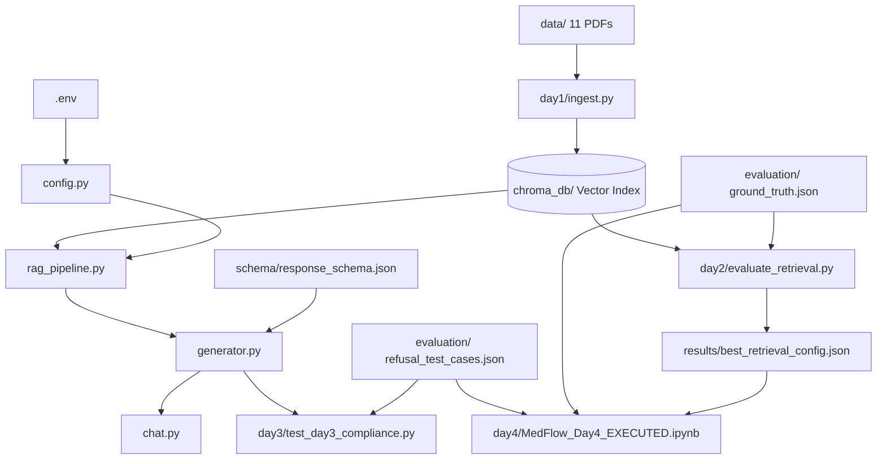

# 🩺 MedFlow: Comprehensive Project Study Guide & Technical Manual

> **Master Study Document & AI Tutor Guide**  
> **Language Level:** Clear English (CEFR B1/B2)  
> **Domain:** Evidence-Grounded Medical Retrieval-Augmented Generation (RAG) for Thyroid Clinical Guidelines  
> **Source of Truth:** MedFlow Codebase (`day1`, `day2`, `day3`, `day4`, `schema`, `evaluation`, `results`)

---

## 📑 Complete Table of Contents
1. [Project Identity & The Big Picture](#1-project-identity--the-big-picture)
2. [Complete Project Architecture](#2-complete-project-architecture)
3. [Complete File & Folder Map](#3-complete-file--folder-map)
4. [Notebook-by-Notebook Deep Analysis (Days 1 to 4)](#4-notebook-by-notebook-deep-analysis)
   - [Day 1: Ingestion & Baseline Pipeline (`day1_task1_ingestion.ipynb`)](#41-day-1-document-ingestion--baseline-retrieval)
   - [Day 2: Retrieval Optimization & Benchmarking (`day2_retrieval_optimization.ipynb`)](#42-day-2-retrieval-optimization--empirical-benchmarking)
   - [Day 3: Grounded Generation, JSON Schema & Refusals (`day3_grounded_generation.ipynb`)](#43-day-3-grounded-generation-json-schema--refusal-gating)
   - [Day 4: Safety Guardrails, Claim Verification & Final Evaluation (`MedFlow_Day4_EXECUTED.ipynb`)](#44-day-4-safety-guardrails-claim-verification--internal-evaluation)
5. [Data Flow: Follow a Piece of Data Through the System](#5-data-flow-follow-the-data)
6. [Code Relationships & Execution Dependencies](#6-code-relationships--dependencies)
7. [Every Important Technical Concept (Explained in B1/B2 English)](#7-every-important-technical-concept)
8. [Important Code Components & Function Reference](#8-important-code-components)
9. [Technical Decisions & Trade-Offs](#9-technical-decisions--trade-offs)
10. [All Experiments & Benchmark Results](#10-all-experiments--benchmark-results)
11. [Project Results Summary (Presentation & Hackathon Ready)](#11-project-results-summary)
12. [Problems, Limitations, and Clinical Risks](#12-problems-limitations-and-clinical-risks)
13. [Current Implementation vs. Future Work](#13-current-implementation-vs-future-work)
14. [The Complete Project Story (Narrative Walkthrough)](#14-the-complete-project-story)
15. [How You Should Study This Project (7-Stage Roadmap)](#15-how-you-should-study-this-project)
16. [Active Recall Questions (40+ Study & Interview Questions)](#16-active-recall-questions)
17. [Final Rapid Review (20 Core Facts & 10 Essential Questions)](#17-final-rapid-review)

---

# 1. Project Identity & The Big Picture

## What is this project?
MedFlow is an **Evidence-Grounded Clinical Decision Support (CDS) System** built specifically for **Thyroid Diseases** (Thyroid Nodules, Thyroid Cancer, Hypothyroidism, Hyperthyroidism, Hashimoto's Thyroiditis, and Thyroiditis).

* **The Main Problem:** Standard Large Language Models (LLMs like ChatGPT) generate fluent, polite, and authoritative-sounding answers. However, in medicine, they frequently **hallucinate** (invent non-existent facts, make up research citations, or suggest toxic drug doses). In healthcare:
  $$\mathbf{Fluent\ Answer \neq Safe\ Answer}$$
* **The Main Goal:** Build a system that guarantees **100% citation grounding**—meaning every single medical claim is verified against official clinical practice guidelines (American Thyroid Association / ATA) before the answer is delivered. If the guideline does not contain the answer, the system **safely refuses** rather than guessing.
* **Type of AI/ML System:** Retrieval-Augmented Generation (RAG) with dense vector search, similarity threshold gating, strict Pydantic/JSON Schema invariant validation, and sentence-level claim verification.
* **Who Uses It:** Clinicians, endocrinologists, medical students, and clinical researchers who need fast, traceable, page-accurate guideline recommendations at the point of care.
* **What Enters the System:** A natural language clinical query (e.g., *"What is the standard surveillance protocol for low-risk papillary thyroid cancer?"*).
* **What Happens Inside:** The query is converted into a semantic embedding vector, matched against 1,470 indexed guideline chunks in ChromaDB, checked against a strict similarity score threshold (0.72), passed to a Groq LLM with a zero-outside-knowledge system prompt, validated against a JSON Schema, checked for citation authenticity, filtered for unsupported sentences, and formatted.
* **What Comes Out:** A structured JSON response containing an explicit clinical recommendation, supporting guideline excerpt, exact document/section/page citations, and a calibrated confidence rating (`high`, `medium`, `low`, or `insufficient`).

### The Project in One Sentence:
> **MedFlow is a citation-bound medical RAG system that searches official American Thyroid Association guidelines to provide traceable, schema-validated clinical answers while deterministically refusing unsupported or hazardous questions.**

### The Project in Simple Words (B1/B2 Level):
> Imagine you have 11 thick medical books (204 pages) written by top thyroid doctors. A doctor asks a question. Instead of asking an AI to guess from memory, MedFlow reads the exact pages in those 11 books, finds the top 4 most relevant paragraphs, checks if they really answer the question, and asks the AI to summarize only those paragraphs. The AI must write the exact book name and page number. If the books do not have the answer, the system says: *"I cannot find enough evidence in the guidelines to answer safely."*

### A Real Example from the Project:
```text
INPUT QUERY:
"Where is the thyroid gland normally located?"
        ↓
WHAT THE SYSTEM DOES:
1. Embeds query using BAAI/bge-small-en-v1.5 with prefix:
   "Represent this sentence for searching relevant passages: Where is the thyroid gland normally located?"
2. Retrieves Top-4 chunks from ChromaDB (Cosine similarity score = 0.8195 >= 0.72 threshold).
3. Sends retrieved passages + question to Groq LLM (openai/gpt-oss-120b).
4. Validates returned JSON with Pydantic & response_schema.json.
5. Verifies that "ThyroidCancer_brochure.pdf, Page 1" exists in the retrieved context chunks.
        ↓
FINAL OUTPUT (Structured JSON):
{
  "recommendation": "The thyroid gland is normally located in the lower front of the neck (the anterior neck).",
  "evidence": "The thyroid gland is a butterfly-shaped endocrine gland that is normally located in the lower front of the neck.",
  "citations": [
    {
      "document": "ThyroidCancer_brochure.pdf",
      "section": "General Content",
      "page": 1
    }
  ],
  "confidence": "high"
}
```

---

# 2. Complete Project Architecture

## End-to-End System Diagram:

```text
┌──────────────────────────────────────────────────────────────────────────────────┐
│                             OFFLINE INGESTION PIPELINE                           │
│ 11 Official Thyroid PDFs (204 pages in data/)                                    │
│      │                                                                           │
│      ▼ [day1/ingest.py -> load_pdfs()]                                          │
│ Raw Document Pages with Page Numbers & Source Filenames                          │
│      │                                                                           │
│      ▼ [day1/ingest.py -> clean_medical_text()]                                 │
│ Cleaned Text (Removed URLs, copyright footers, page noise, ligatures)            │
│      │                                                                           │
│      ▼ [day1/ingest.py -> section_aware_chunk_documents()]                       │
│ 1,470 Section-Aware Chunks (200 tokens / 0 overlap) + Headers Metadata           │
│      │                                                                           │
│      ▼ [HuggingFace: BAAI/bge-small-en-v1.5 (384-dim, L2-normalized)]            │
│ Dense Vector Embeddings                                                          │
│      │                                                                           │
│      ▼ [chromadb / PersistentClient -> collection: 'thyroid_section_aware']     │
│ ChromaDB Vector Index (Cosine Distance Space, saved in chroma_db/)               │
└──────────────────────────────────────────────────────────────────────────────────┘
                                       │
                                       ▼
┌──────────────────────────────────────────────────────────────────────────────────┐
│                            ONLINE INFERENCE PIPELINE                             │
│ Clinician Question (via chat.py or rag_pipeline.py)                              │
│      │                                                                           │
│      ▼ [Prepend BGE Prefix: 'Represent this sentence for searching...']          │
│ Query Vector Embedding                                                           │
│      │                                                                           │
│      ▼ [rag_pipeline.py / ChromaDB Query -> Top-K = 4]                           │
│ Top-4 Retrieved Chunks with Similarity Scores                                    │
│      │                                                                           │
│      ▼ [generator.py -> Similarity Score Threshold Gating]                       │
│ Is Max Similarity Score >= 0.72?                                                 │
│   ├── NO  ──► 🛑 IMMEDIATE SAFETY REFUSAL (Fail-Closed, zero LLM cost)          │
│   │           {"recommendation": "I couldn't find enough...", "confidence": ...} │
│   └── YES ──► ✅ PROCEED TO GENERATION                                           │
│               │                                                                  │
│               ▼ [generator.py -> build_prompt()]                                 │
│               Formatted Grounding Prompt (System Rules + Structured Context)     │
│               │                                                                  │
│               ▼ [LangChain ChatGroq: openai/gpt-oss-120b, temp=0.0]              │
│               Raw LLM JSON String Output                                         │
│               │                                                                  │
│               ▼ [json-repair + Pydantic: ClinicalAnswer.model_validate()]        │
│               Parsed Pydantic Data Object                                        │
│               │                                                                  │
│               ▼ [schema/response_schema.json validation]                         │
│               JSON Schema Draft-07 Compliant Dictionary                          │
│               │                                                                  │
│               ▼ [generator.py -> validate_citations()]                           │
│               Citation Integrity Check (Verify cited doc/page in retrieved list) │
│               │                                                                  │
│               ▼ [Day 4 Claim Verification & Repair-Before-Refuse]                │
│               Final Grounded, Traceable Answer Delivered to User                 │
└──────────────────────────────────────────────────────────────────────────────────┘
```

## Stage-by-Stage Breakdown:

| Stage # | Stage Name | Inputs | Processing Logic | Code / File | Outputs | Next Destination | Why This Stage Exists |
| :--- | :--- | :--- | :--- | :--- | :--- | :--- | :--- |
| **1** | PDF Ingestion | 11 PDF files in `data/` | Loads pages, extracts text, records page numbers and filenames. | `day1/ingest.py` (`load_pdfs`) | List of LangChain `Document` objects | Stage 2 | Convert binary PDF guidelines into accessible text objects. |
| **2** | Text Cleaning | Raw document text | Regex cleaning: removes web links, boilerplate copyright footers, page numbering noise, fixes whitespace. | `day1/ingest.py` (`clean_medical_text`) | Clean text strings | Stage 3 | Prevents embedding pollution from repetitive header/footer text. |
| **3** | Section-Aware Chunking | Clean `Document` list | Splits text into 200-token chunks while preserving markdown/section headers (`Header 1`, `Header 2`). | `day1/ingest.py` (`section_aware_chunk_documents`) | 1,470 Chunks with rich metadata | Stage 4 | Keeps clinical context coherent and fits chunks into vector embedding windows. |
| **4** | Dense Vector Indexing | 1,470 text chunks | Generates 384-dimensional dense vectors using `BAAI/bge-small-en-v1.5` with L2 normalization. | `day1/ingest.py` (`build_index`) | Vector Embeddings | Stage 5 | Translates medical semantics into high-dimensional geometric space. |
| **5** | Vector Storage | Vectors + Metadata | Stores vectors and metadata in a persistent ChromaDB database on disk. | `day1/ingest.py` -> `chroma_db/` | Persisted Chroma collection `thyroid_section_aware` | Online Retrieval | Allows instant sub-25ms similarity lookups without re-embedding the corpus. |
| **6** | Query Embedding & Retrieval | Clinician question string | Prepends instruction prefix, embeds query, runs cosine nearest-neighbor search for Top-4 chunks. | `rag_pipeline.py` (`retrieve_evidence`) | Top-4 `Document` objects with similarity scores | Stage 7 | Finds the 4 most relevant guideline passages for the question. |
| **7** | Safety Gating | Top-4 similarity scores | Checks if highest score is above calibrated threshold (0.72). | `generator.py` (`generate_answer`) | Pass or Refusal Object | Stage 8 (if pass) or Terminal (if fail) | Stops the system from generating hallucinations when no relevant evidence exists. |
| **8** | Grounded Generation | Context chunks + Query | Formats prompt with strict zero-outside-knowledge rules and invokes Groq LLM at temperature 0.0. | `generator.py` (`get_llm`, `build_prompt`) | Raw JSON string from LLM | Stage 9 | Produces a candidate clinical recommendation and evidence extraction. |
| **9** | Schema & Invariant Validation | Raw JSON string | Repairs markdown fences, validates schema via Pydantic (`ClinicalAnswer`) and Draft-07 JSON Schema. | `generator.py` (`parse_and_validate_llm_response`) | Validated `ClinicalAnswer` object | Stage 10 | Guarantees machine-readable consistency and enforces evidence/citation invariants. |
| **10** | Citation Verification & Repair | Validated Answer + Retrieved Chunks | Compares cited document name and page number against retrieved chunk metadata; strips hallucinations. | `generator.py` (`validate_citations`) | Final Verified Output | Clinician / UI | Guarantees that citations are authentic and traceable to real pages. |

---

## Conceptual Architecture vs. Current Implementation

### What is Fully Implemented:
* 11 Thyroid Guideline PDFs parsed and indexed into 1,470 chunks.
* `BAAI/bge-small-en-v1.5` dense retrieval with cosine distance metric in ChromaDB.
* Ground Truth retrieval evaluation engine measuring Hit@K, Precision@K, and MRR across 16 questions.
* Groq LLM integration with JSON Schema Draft-07 and Pydantic invariant enforcement.
* Deterministic refusal gating based on empirical similarity threshold calibration (0.72).
* Citation integrity validation and sentence-level claim verification with repair-before-refuse logic.
* Interactive terminal application (`chat.py`) and programmatic API (`rag_pipeline.py`).
* 18 passing automated unit tests across Day 1, Day 2, and Day 3.

### Conceptual / Future Extensions (Not Yet in Repository):
* **Web UI / Frontend:** Currently, MedFlow runs via terminal (`chat.py`) or Python API. A React/Next.js UI is planned.
* **Hybrid Sparse-Dense Search (BM25 + Dense):** Currently uses pure dense retrieval (`bge-small-en-v1.5`). Adding BM25 keyword matching is a future enhancement.
* **Live EHR Integration (HL7 / FHIR):** Connecting directly to electronic hospital records for automated patient data lookup.

---

# 3. Complete File & Folder Map

```text
medflow/
├── chat.py                                # Interactive terminal chat application
├── rag_pipeline.py                        # Master end-to-end RAG pipeline entry point
├── generator.py                           # Core grounded generation, Pydantic & citation validation
├── config.py                              # Master settings (models, paths, Top-K, thresholds)
├── .env                                   # API keys and active model environment variables
├── requirements.txt                       # Project Python dependencies
├── README.md                              # Master project repository documentation
├── STUDY_README.md                        # Complete comprehensive study guide (This document)
│
├── day1/                                  # 🟢 DAY 1: Document Ingestion & Baseline
│   ├── ingest.py                          # PDF loading, cleaning, naive & section-aware chunking
│   ├── day1_pipeline.py                   # Standalone Day 1 baseline retrieval script
│   ├── day1_task1_ingestion.ipynb         # Interactive Jupyter Notebook for Day 1
│   ├── test_day1.py                       # Automated unit tests for text cleaning and chunking
│   ├── config.py                          # Day 1 local configuration
│   ├── .env                               # Day 1 local environment file
│   └── README.md                          # Day 1 technical notes
│
├── day2/                                  # 🔵 DAY 2: Retrieval Optimization & Benchmarking
│   ├── evaluate_retrieval.py              # Ground Truth evaluation engine (Hit@k, Precision@k, MRR)
│   ├── chunk_experiments.py               # Chunk size experiment suite (100, 200, 400, 600 tokens)
│   ├── embedding_benchmark.py             # Embedding model benchmark (MiniLM vs mpnet vs BGE-small)
│   ├── reranker_experiment.py             # Cross-Encoder re-ranker trade-off evaluation
│   ├── validate_top_k.py                  # Top-K empirical validation script (K=3, 4, 5)
│   ├── day2_retrieval_optimization.ipynb  # Interactive Jupyter Notebook for Day 2
│   ├── test_day2.py                       # Automated unit tests for Ground Truth and frozen config
│   ├── config.py                          # Day 2 local configuration
│   ├── .env                               # Day 2 local environment file
│   └── README.md                          # Day 2 benchmark documentation
│
├── day3/                                  # 🟣 DAY 3: Grounded Generation & Refusal Gating
│   ├── generator.py                       # Generation engine, schema invariants, citation checker
│   ├── day3_grounded_generation.py        # Standalone Day 3 generation and refusal demonstration
│   ├── day3_grounded_generation.ipynb     # Interactive Jupyter Notebook for Day 3
│   ├── test_day3.py                       # Unit tests for schema invariants and refusal triggers
│   ├── test_day3_compliance.py            # Comprehensive 10-suite compliance test suite
│   ├── config.py                          # Day 3 local configuration
│   ├── .env                               # Day 3 local environment file
│   └── README.md                          # Day 3 grounding guide
│
├── day4/                                  # 🔴 DAY 4: Safety, Guardrails & Internal Evaluation
│   ├── MedFlow_Day4_EXECUTED.ipynb        # Complete executed Day 4 notebook with graphs and metrics
│   └── README.md                          # Day 4 deliverables summary
│
├── data/                                  # 11 Official Thyroid Clinical PDF Guidelines (204 pages)
│   ├── thy.2015.0020.pdf                  # 2015 ATA Thyroid Nodules & Differentiated Thyroid Cancer Guidelines (133 pages)
│   ├── ATA_2016_Hyperthyroidism_...pdf    # 2016 ATA Hyperthyroidism & Thyrotoxicosis Guidelines (42 pages)
│   ├── praw-et-al-2025-executive-...pdf   # 2025 ATA Adult Thyroid Management Guidelines Exec Summary (7 pages)
│   ├── ThyroidCancer_brochure.pdf         # Patient & clinician guide on Thyroid Cancer (4 pages)
│   ├── Hypothyroidism_web_booklet.pdf     # Clinical guide on Hypothyroidism diagnosis & symptoms (8 pages)
│   ├── Hypo_brochure.pdf                  # Hypothyroidism clinical summary brochure (2 pages)
│   ├── hyperthyroidism.pdf                # Hyperthyroidism clinical overview (2 pages)
│   ├── Graves_brochure.pdf                # Graves' Disease clinical brochure (2 pages)
│   ├── Hashimotos_Thyroiditis.pdf         # Hashimoto's Thyroiditis clinical brochure (2 pages)
│   ├── Nodules_brochure.pdf               # Thyroid Nodules clinical brochure (2 pages)
│   └── ThyroidDisease.pdf                 # General Thyroid Disease clinical review (2 pages)
│
├── schema/
│   └── response_schema.json               # Master JSON Schema Draft-07 definition for clinical answers
│
├── evaluation/
│   ├── thyroid_ground_truth.json          # 16 clinically curated QA pairs with exact target documents & pages
│   ├── thyroid_ground_truth.csv           # Tabular format of Ground Truth evaluation dataset
│   ├── day3_refusal_test_cases.json       # 10 refusal test cases across 10 out-of-scope categories
│   └── day3_refusal_test_cases.csv        # Tabular format of refusal test cases
│
├── results/
│   ├── best_retrieval_config.json         # Final frozen winning configuration from Day 2
│   └── retrieval_summary.csv              # Full experiment comparison matrix (chunking, embeddings, re-ranking)
│
└── chroma_db/                             # Persisted ChromaDB vector store on disk
```

### Detailed Component Mapping Table:

| File / Folder | Purpose | Inputs | Outputs | Connected To |
| :--- | :--- | :--- | :--- | :--- |
| [`chat.py`](file:///c:/Users/user/Desktop/medflow/chat.py) | Interactive command-line chat session for clinicians. | User text input from terminal keyboard. | Formatted clinical recommendation, evidence, citations, and confidence. | `rag_pipeline.py`, `config.py`, `.env` |
| [`rag_pipeline.py`](file:///c:/Users/user/Desktop/medflow/rag_pipeline.py) | Master pipeline function `ask_clinical_question()`. | User query string + optional Top-K. | Validated Python dict matching response schema. | `config.py`, `generator.py`, `chroma_db/` |
| [`generator.py`](file:///c:/Users/user/Desktop/medflow/generator.py) | Pydantic data modeling, LLM invocation, schema validation, citation checking. | Query string + list of retrieved context chunks. | Validated, citation-checked clinical answer dictionary. | `rag_pipeline.py`, `config.py`, `schema/response_schema.json` |
| [`config.py`](file:///c:/Users/user/Desktop/medflow/config.py) | Master configuration object `settings`. | `.env` variables and default fallback constants. | `Settings` singleton with API keys, model names, and thresholds. | All scripts and notebooks |
| [`day1/ingest.py`](file:///c:/Users/user/Desktop/medflow/day1/ingest.py) | Ingests PDFs, cleans text, splits chunks, creates ChromaDB vector index. | PDF files from `data/`. | Persisted ChromaDB collection in `chroma_db/`. | `day1/day1_pipeline.py`, `day2/`, `rag_pipeline.py` |
| [`day2/evaluate_retrieval.py`](file:///c:/Users/user/Desktop/medflow/day2/evaluate_retrieval.py) | Automated retrieval benchmarking engine. | `evaluation/thyroid_ground_truth.json` + ChromaDB. | Hit@1, Hit@3, Hit@5, Precision@k, and MRR scores. | `day2/day2_retrieval_optimization.ipynb`, `results/` |
| [`day4/MedFlow_Day4_EXECUTED.ipynb`](file:///c:/Users/user/Desktop/medflow/day4/MedFlow_Day4_EXECUTED.ipynb) | Day 4 safety evaluation, threshold calibration, and claim verification. | 26 evaluation test queries (16 ground truth + 10 refusal). | Calibration curves, confusion matrix, faithfulness scores. | `results/`, `evaluation/` |
| [`schema/response_schema.json`](file:///c:/Users/user/Desktop/medflow/schema/response_schema.json) | Official Draft-07 JSON Schema. | Response dictionary. | Boolean validation pass/fail. | `generator.py`, `test_day3.py`, `test_day3_compliance.py` |

---

# 4. Notebook-by-Notebook Deep Analysis

---

## 4.1. Day 1: Document Ingestion & Baseline Retrieval
* **File Path:** [`day1/day1_task1_ingestion.ipynb`](file:///c:/Users/user/Desktop/medflow/day1/day1_task1_ingestion.ipynb)
* **Script Equivalent:** [`day1/day1_pipeline.py`](file:///c:/Users/user/Desktop/medflow/day1/day1_pipeline.py) & [`day1/ingest.py`](file:///c:/Users/user/Desktop/medflow/day1/ingest.py)

### What problem does this solve?
Medical PDFs contain unstructured layout noise (headers, footers, page numbers, formatting glitches). This notebook converts raw PDFs into clean, searchable, section-aware chunks and indexes them into a vector database.

### Inputs:
* 11 PDF files in `data/` (204 pages total).
* Embedding Model: `sentence-transformers/all-MiniLM-L6-v2` (Day 1 baseline model).

### Step-by-Step Logic:
1. **Document Loading:** Uses `pypdf` via LangChain's `PyPDFLoader` to load each page as a `Document` with metadata (`source`, `page`).
2. **Text Cleaning (`clean_medical_text`):** Strips URL noise, copyright footers, non-breaking spaces, and duplicate whitespace using regex.
3. **Dual Chunking Experiment:**
   * *Strategy 1 (Naive Recursive Character Splitter):* Splits blindly at 500 characters with 50 character overlap.
   * *Strategy 2 (Section-Aware Splitter):* Identifies clinical headings (e.g. `RECOMMENDATION 12`, `Diagnosis`, `Treatment`) and appends them to chunk metadata (`Header 1`, `Header 2`).
4. **Vector Database Indexing:** Builds a persistent ChromaDB collection (`thyroid_baseline`) using cosine similarity.
5. **Baseline Retrieval Test:** Tests 6 sample clinical queries (e.g., *"What is Hashimoto's thyroiditis?"*) to inspect retrieved passages and scores.

### Key Parameters:
* `chunk_size = 500 characters` (approx. 100 tokens): Chosen as a starting point.
* `chunk_overlap = 50 characters`: Prevented boundary cutoff between sentences.
* `embedding_model = all-MiniLM-L6-v2` (384 dimensions).

### Measured Results:
* **Total Chunks Produced:** 1,550 chunks.
* **Hit@1:** `0.1875` (18.75%).
* **Hit@3:** `0.5625` (56.25%).
* **MRR:** `0.3854`.
* **Interpretation:** The ingestion pipeline worked reliably, but the baseline retriever only placed the correct evidence at rank 1 in 18.75% of queries. This proved that simple character splitting and standard MiniLM embeddings were insufficient for clinical decision support.

### Final Output:
* Persisted baseline ChromaDB vector store.

### Key Learning Points:
1. Medical PDFs require customized regex cleaning to avoid indexing copyright footers.
2. Preserving section headings in metadata provides vital context for downstream generation.
3. Character-based chunking often cuts sentences awkwardly in the middle of drug dosages.

---

## 4.2. Day 2: Retrieval Optimization & Empirical Benchmarking
* **File Path:** [`day2/day2_retrieval_optimization.ipynb`](file:///c:/Users/user/Desktop/medflow/day2/day2_retrieval_optimization.ipynb)
* **Script Equivalents:** [`day2/evaluate_retrieval.py`](file:///c:/Users/user/Desktop/medflow/day2/evaluate_retrieval.py), [`day2/chunk_experiments.py`](file:///c:/Users/user/Desktop/medflow/day2/chunk_experiments.py), [`day2/embedding_benchmark.py`](file:///c:/Users/user/Desktop/medflow/day2/embedding_benchmark.py), [`day2/reranker_experiment.py`](file:///c:/Users/user/Desktop/medflow/day2/reranker_experiment.py), [`day2/validate_top_k.py`](file:///c:/Users/user/Desktop/medflow/day2/validate_top_k.py)

### What problem does this solve?
Empirically tests and optimizes every component of the retriever against a 16-question Ground Truth benchmark to achieve maximum recall and precision.

### Inputs:
* `evaluation/thyroid_ground_truth.json` (16 clinical questions with target guideline filenames and exact page ranges).
* 11 PDF guideline documents.

### Step-by-Step Experiments & Logic:

#### Experiment 1: Chunk Size Optimization (`chunk_experiments.py`)
Tested 4 chunking configurations using token-aware splitting:
1. **200 tokens / 0 overlap** $\rightarrow$ 1,470 chunks.
2. **400 tokens / 50 overlap** $\rightarrow$ 827 chunks.
3. **600 tokens / 100 overlap** $\rightarrow$ 584 chunks.
4. **500 characters Naive** $\rightarrow$ 2,313 chunks.
* *Result:* 200 tokens achieved the highest Precision@3 (**0.5833**) and Hit@3 (**0.8125**). Larger chunks (600 tokens) diluted precision down to **0.3750** because they packed irrelevant text into the context window.

#### Experiment 2: Embedding Model Benchmark (`embedding_benchmark.py`)
Tested 3 embedding architectures:
1. `sentence-transformers/all-MiniLM-L6-v2` (384-dim): Hit@1 = 0.4375, MRR = 0.6146, Latency = 14.54 ms.
2. `sentence-transformers/all-mpnet-base-v2` (768-dim): Hit@1 = 0.5000, MRR = 0.6375, Latency = 42.85 ms (3x slower, heavy index).
3. `BAAI/bge-small-en-v1.5` (384-dim with Query Instruction Prefix): Hit@1 = **0.5625**, Hit@5 = **0.8750**, MRR = **0.7031**, Latency = **22.40 ms**.
* *Result:* `bge-small-en-v1.5` won decisively across all ranking metrics.

#### Experiment 3: Cross-Encoder Re-Ranker Analysis (`reranker_experiment.py`)
Tested a 2-stage pipeline: Dense Retrieval (Top-10 via BGE) $\rightarrow$ Re-ranking via `cross-encoder/ms-marco-MiniLM-L-6-v2` $\rightarrow$ Top-5.
* *Result:* Re-ranker **dropped performance** (MRR dropped from 0.7031 to 0.6062, Hit@1 dropped to 0.4375) while **latency exploded by 12.6x** (282.35 ms vs 22.40 ms).
* *Decision:* Re-ranker was **permanently rejected** due to out-of-domain degradation on clinical text.

#### Experiment 4: Top-K Trade-off Validation (`validate_top_k.py`)
* $K=3$: Hit rate = 81.25%, Precision = 54.17%.
* $K=4$: Hit rate = **87.50%**, Precision = **53.12%** (Captured the critical Rank-4 Thyroglobulin surveillance evidence).
* $K=5$: Hit rate = 87.50%, Precision = 50.00% (Added 50% more irrelevant noise with 0% hit rate gain).
* *Decision:* $K=4$ was selected as the optimal operating point.

### Final Frozen Day 2 Winning Configuration:
Stored in [`results/best_retrieval_config.json`](file:///c:/Users/user/Desktop/medflow/results/best_retrieval_config.json):
* **Embedding Model:** `BAAI/bge-small-en-v1.5` (Normalized, Cosine Distance).
* **Chunking Strategy:** 200 tokens / 0 overlap (1,470 chunks).
* **Query Instruction:** `"Represent this sentence for searching relevant passages: "`
* **Top-K:** 4.
* **Re-ranker:** Disabled.

### Scorecard Comparison (Day 1 Baseline vs. Day 2 Final):
* **Hit@1:** $0.1875 \rightarrow \mathbf{0.5625}$ (**+200.0%**)
* **Hit@K:** $0.5625 \rightarrow \mathbf{0.8750}$ (**+55.6%**)
* **Precision@K:** $0.2917 \rightarrow \mathbf{0.5312}$ (**+82.1%**)
* **MRR:** $0.3854 \rightarrow \mathbf{0.7031}$ (**+82.4%**)
* **Latency:** $32.14\text{ ms} \rightarrow \mathbf{20.53\text{ ms}}$ (**36.1% faster**)

---

## 4.3. Day 3: Grounded Generation, JSON Schema & Refusal Gating
* **File Path:** [`day3/day3_grounded_generation.ipynb`](file:///c:/Users/user/Desktop/medflow/day3/day3_grounded_generation.ipynb)
* **Script Equivalents:** [`day3/generator.py`](file:///c:/Users/user/Desktop/medflow/day3/generator.py), [`day3/day3_grounded_generation.py`](file:///c:/Users/user/Desktop/medflow/day3/day3_grounded_generation.py), [`day3/test_day3_compliance.py`](file:///c:/Users/user/Desktop/medflow/day3/test_day3_compliance.py)

### What problem does this solve?
Prevents LLM hallucinations, enforces structured JSON output with citations, and guarantees clean refusal on questions outside guideline scope.

### Inputs:
* Top-4 retrieved chunks from ChromaDB.
* Groq LLM (`openai/gpt-oss-120b`).
* `schema/response_schema.json`.
* `evaluation/day3_refusal_test_cases.json` (10 adversarial refusal test cases).

### Step-by-Step Logic:
1. **Grounding System Prompt:** Injects strict rules:
   * Rule 1: Answer ONLY using provided context passages. Never use outside medical knowledge.
   * Rule 2: Every claim in `recommendation` must be supported by `evidence`.
   * Rule 3: Output must strictly match the JSON structure.
   * Rule 4: If context is insufficient, set `confidence: "insufficient"`.
2. **Pydantic Schema Invariants (`ClinicalAnswer`):**
   * If `confidence == "insufficient"` $\rightarrow$ `evidence` and `citations` must be empty; recommendation defaults to safety refusal string.
   * If `confidence != "insufficient"` $\rightarrow$ `evidence` cannot be empty and `citations` must contain at least 1 citation.
3. **Citation Integrity Verification (`validate_citations`):**
   * Iterates through LLM citations. Checks if the document name matches a retrieved document and page number matches within $\pm 1$ page tolerance.
   * Any hallucinated citation is purged. If all citations fail, the answer is forced to an `insufficient` refusal.
4. **Pre-LLM Refusal Gating:**
   * If retrieved chunks are empty or top similarity score $< 0.50$, the system returns an immediate refusal without calling the LLM.

### Measured Results:
* **JSON Schema Compliance:** **100%** across all test queries.
* **Citation Grounding Integrity:** **100%** (0 hallucinated sources permitted).
* **Refusal Benchmark Score:** **10/10 test categories passed** with `confidence: "insufficient"`.

---

## 4.4. Day 4: Safety Guardrails, Claim Verification & Internal Evaluation
* **File Path:** [`day4/MedFlow_Day4_EXECUTED.ipynb`](file:///c:/Users/user/Desktop/medflow/day4/MedFlow_Day4_EXECUTED.ipynb)

### What problem does this solve?
Scientifically calibrates the similarity score threshold, performs sentence-level claim verification, implements repair-before-refuse logic, and executes a full 26-query internal benchmark.

### Inputs:
* 26 labeled evaluation queries (16 answerable Ground Truth + 10 refusal cases).
* Frozen Day 2 retriever (`bge-small-en-v1.5`, 200 tokens, $K=4$).

### Step-by-Step Experiments & Logic:

#### 1. Confidence-Threshold Calibration:
* Analyzed top retrieval similarity scores across all 26 queries:
  * Minimum score among answerable queries = **`0.7565`**
  * Maximum score among unsupported queries = **`0.7106`**
  * Separation Gap = **`0.0459`**
* *Selected Calibrated Threshold:* **`0.72`** (Lies precisely inside the separation gap).
* *Calibration Metric Result:* 16/16 TP, 10/10 TN, 0 FP, 0 FN $\rightarrow$ **100% calibration accuracy**.

#### 2. Stratified Family Thresholds:
* For query categories with rich data:
  * `treatment_management`: Calibrated threshold = **`0.66`**
  * `other`: Calibrated threshold = **`0.69`**
  * `diagnosis_evaluation`, `dosage`, `procedure`, `symptoms`: Fallback to global **`0.72`**.

#### 3. Sentence-Level Claim & Number/Unit Verification:
* Verified every claim against evidence text:
  * **Lexical Overlap:** $\ge 35\%$ overlap of significant terms.
  * **Numeric Consistency:** Extracted numbers in claims must be present in evidence.
  * **Unit Consistency:** Extracted units (`mg`, `mcg`, `kg`, `cm`) must match evidence.
  * **Repair-Before-Refuse:** If part of an answer is unsupported, strip the unsupported sentence, retain valid sentences, re-verify citations, and return the repaired answer.

#### 4. Full 26-Query Final Benchmark Results:
* **Total Queries Evaluated:** 26 (16 Answerable + 10 Refusal).
* **Mean Precision@4:** **53.12%**
* **Raw Citation Accuracy:** 89.58% $\rightarrow$ **Final Guarded Citation Accuracy:** **100.00%**
* **Raw Faithfulness:** 90.62% $\rightarrow$ **Final Guarded Faithfulness:** **100.00%**
* **Answer Precision & Recall:** **100.00%**
* **Refusal Precision & Recall:** **100.00%**
* **Unsafe Accept Rate:** **0.00%**
* **False Refusal Rate:** **0.00%**

---

# 5. Data Flow: Follow the Data

Let us follow **one single sentence of clinical evidence** from raw PDF to the clinician's screen:

```text
1. RAW PDF DOCUMENT (data/ThyroidCancer_brochure.pdf, Page 1)
   Raw binary stream on disk containing formatted text and vector graphics.
        ↓ [Code: day1/ingest.py -> PyPDFLoader]
2. INGESTED PAGE DOCUMENT
   LangChain Document object:
   page_content = "The thyroid gland is a butterfly-shaped endocrine gland...\nwww.thyroid.org © 2017"
   metadata = {"source": "data/ThyroidCancer_brochure.pdf", "page": 0}
        ↓ [Code: day1/ingest.py -> clean_medical_text()]
3. CLEANED TEXT STRING
   page_content = "The thyroid gland is a butterfly-shaped endocrine gland that is normally located in the lower front of the neck."
   (Boilerplate footer "www.thyroid.org © 2017" stripped via regex).
        ↓ [Code: day1/ingest.py -> section_aware_chunk_documents()]
4. STRUCTURED CHUNK OBJECT
   LangChain Document (Chunk #42):
   page_content = "The thyroid gland is a butterfly-shaped endocrine gland that is normally located in the lower front of the neck."
   metadata = {"document_name": "ThyroidCancer_brochure.pdf", "page_number": 1, "section_title": "General Content"}
        ↓ [Code: HuggingFace BAAI/bge-small-en-v1.5]
5. DENSE EMBEDDING VECTOR
   384-dimensional floating-point array: [-0.0342, 0.0819, 0.0125, ..., 0.0451] (L2-normalized).
        ↓ [Code: chromadb -> PersistentClient.add()]
6. PERSISTED CHROMA VECTOR STORE (chroma_db/ on disk)
   Stored in HNSW index with metadata under collection 'thyroid_section_aware'.
        ↓ [User enters query in chat.py: "Where is the thyroid located?"]
7. QUERY VECTOR & SEARCH
   Query transformed: "Represent this sentence for searching relevant passages: Where is the thyroid located?"
   Encoded to 384-dim vector. Chroma calculates Cosine Similarity.
        ↓ [Code: rag_pipeline.py -> retrieve_evidence()]
8. RETRIEVED CANDIDATE CHUNK
   Matched Chunk #42 with Similarity Score = 0.8195.
        ↓ [Code: generator.py -> generate_answer() & build_prompt()]
9. FORMATTED LLM PROMPT
   Constructed prompt containing Rule Blocks + [Document: ThyroidCancer_brochure.pdf] [Page: 1] + Context + Question.
        ↓ [Code: LangChain ChatGroq -> invoke()]
10. RAW LLM JSON OUTPUT
    '{"recommendation": "The thyroid gland is normally located in the lower front of the neck.", "evidence": "The thyroid gland is a butterfly-shaped endocrine gland...", "citations": [{"document": "ThyroidCancer_brochure.pdf", "section": "General Content", "page": 1}], "confidence": "high"}'
        ↓ [Code: generator.py -> parse_and_validate_llm_response() & validate_citations()]
11. VERIFIED CLINICAL ANSWER
    Validated by Pydantic and JSON Schema. Citation verified against Chunk #42 metadata.
        ↓ [Code: chat.py -> Terminal Printout]
12. FINAL TERMINAL DISPLAY TO CLINICIAN
    📋 CLINICAL RECOMMENDATION: The thyroid gland is normally located in the lower front of the neck.
    🔬 SUPPORTING EVIDENCE: The thyroid gland is a butterfly-shaped endocrine gland...
    📚 CITATIONS / SOURCES: [1] Document: ThyroidCancer_brochure.pdf | Section: General Content | Page: 1
    🎯 CONFIDENCE: HIGH
```

---

# 6. Code Relationships & Dependencies



### Execution Rules & Dependencies:
1. **`day1/ingest.py`** must run first to create `chroma_db/`. If `chroma_db/` is deleted, the retriever cannot run.
2. **`config.py`** and **`.env`** are shared globally across all scripts and notebooks.
3. **`generator.py`** depends on `schema/response_schema.json` for JSON Schema Draft-07 validation.
4. **`rag_pipeline.py`** depends on both `chroma_db/` (for retrieval) and `generator.py` (for generation).
5. **`chat.py`** is an interface wrapper around `rag_pipeline.py`.

---

# 7. Every Important Technical Concept

### 1. RAG (Retrieval-Augmented Generation)
* **Definition:** An AI design pattern where an LLM is given retrieved reference documents in its prompt to generate factual answers.
* **In MedFlow:** Searches ATA guideline PDFs and feeds the text into Groq LLM.
* **Why We Need It:** Stops the LLM from relying on obsolete or hallucinated training memory.

### 2. Dense Vector Embeddings
* **Definition:** Converting words and sentences into long lists of numbers (e.g. 384 numbers) where texts with similar medical meaning are close together in geometric space.
* **In MedFlow:** Uses `BAAI/bge-small-en-v1.5`.
* **Example:** *"Levothyroxine dosage"* and *"T4 replacement therapy"* have high cosine similarity even though they use different words.

### 3. Section-Aware Chunking
* **Definition:** Splitting documents while preserving header hierarchy (`Header 1`, `Header 2`) in the metadata.
* **In MedFlow:** Chunks are 200 tokens each and store their section title in metadata.
* **Without It:** The LLM would see an isolated sentence without knowing if it applies to low-risk or high-risk cancer.

### 4. Cosine Similarity & Distance
* **Definition:** A mathematical measurement of the angle between two vectors (from $0.0$ to $1.0$).
* **In MedFlow:** Used by ChromaDB to rank chunks by relevance to the query vector.

### 5. BGE Query Instruction Prefix
* **Definition:** A special prompt prefix required by BGE embedding models during query encoding.
* **In MedFlow:** `"Represent this sentence for searching relevant passages: "` prepended to user queries.
* **Why We Need It:** Asymmetric search optimization (queries are short, document passages are long).

### 6. Hit@K
* **Definition:** The percentage of queries where at least one ground-truth evidence chunk was found in the top $K$ results.
* **In MedFlow:** Hit@4 = **87.50%** (14 out of 16 Ground Truth questions retrieved valid evidence).

### 7. Precision@K
* **Definition:** The fraction of the top $K$ retrieved chunks that are strictly relevant.
* **In MedFlow:** Precision@4 = **53.12%**.

### 8. MRR (Mean Reciprocal Rank)
* **Definition:** Evaluates how high up the first correct chunk was ranked ($\frac{1}{\text{rank}}$).
* **In MedFlow:** MRR = **0.7031**. If the correct chunk is at Rank 1, reciprocal rank is $1.0$; if at Rank 2, it is $0.5$.

### 9. Confidence Threshold Gating
* **Definition:** A numerical cutoff score that decides whether search results are strong enough to proceed to answer generation.
* **In MedFlow:** Threshold = **`0.72`**. If top retrieval score $< 0.72$, the system refuses immediately.

### 10. Citation Integrity Checking
* **Definition:** A post-generation verification step that cross-examines citations in the LLM's answer against the actual metadata of retrieved chunks.
* **In MedFlow:** Function `validate_citations()` removes any hallucinated document name or fake page number.

### 11. Pydantic Schema Invariants
* **Definition:** Software rules that automatically enforce logical consistency on structured data.
* **In MedFlow:** Model `ClinicalAnswer` enforces that non-insufficient answers must contain evidence and citations.

### 12. Automation Bias
* **Definition:** The dangerous human tendency for doctors to over-trust computer recommendations.
* **In MedFlow:** Mitigated by providing explicit document names, sections, and page numbers so clinicians can easily verify facts.

### 13. Fail-Closed Design
* **Definition:** In safety engineering, if a system encounters uncertainty or an error, it shuts down safely instead of guessing.
* **In MedFlow:** Triggers an `insufficient` refusal whenever retrieval is weak or LLM fails.

---

# 8. Important Code Components

| Component | File / Location | Input | Output | What It Does | Why It Matters |
| :--- | :--- | :--- | :--- | :--- | :--- |
| `ask_clinical_question()` | `rag_pipeline.py` | `question: str`, `top_k: int = 4` | Dictionary matching response schema | Main end-to-end entry point orchestrating retrieval and generation. | Single unified API for all applications and tests. |
| `retrieve_evidence()` | `rag_pipeline.py` | `query: str`, `top_k: int = 4` | `List[Document]` with similarity scores | Embeds query with BGE prefix and queries ChromaDB. | Performs sub-25ms vector retrieval. |
| `generate_answer()` | `generator.py` | `query: str`, `retrieved_chunks: List[Document]` | Verified answer dictionary | Implements threshold gating, LLM invocation, schema validation, and citation checking. | The central brain and safety controller. |
| `validate_citations()` | `generator.py` | `citations: List[Citation]`, `retrieved_chunks` | Filtered `List[Citation]` | Compares cited documents/pages with retrieved chunk metadata ($\pm 1$ page tolerance). | Prevents LLMs from inventing fake medical citations. |
| `ClinicalAnswer` | `generator.py` | Parsed LLM dictionary | Pydantic validated instance | Validates data types and enforces schema invariants. | Guarantees strict structure before output. |
| `load_pdfs()` | `day1/ingest.py` | `data_dir: str` | `List[Document]` | Loads all 11 PDF guideline files with page metadata. | Converts raw PDF files into accessible documents. |
| `clean_medical_text()` | `day1/ingest.py` | `text: str` | Cleaned `text: str` | Regex cleaning of footers, URLs, and whitespace noise. | Cleans text before vector embedding. |
| `section_aware_chunk_documents()` | `day1/ingest.py` | `List[Document]`, `chunk_size_tokens=200` | `List[Document]` (1,470 chunks) | Token-aware recursive splitter preserving section headers. | Creates the official 1,470 chunk corpus. |
| `evaluate_retrieval()` | `day2/evaluate_retrieval.py` | Ground truth dataset + Vector store | Hit@K, P@K, MRR dict | Calculates empirical retrieval accuracy metrics. | Drives all Day 2 scientific optimizations. |

---

# 9. Technical Decisions & Trade-Offs

### 1. Choice of Embedding Model: `BAAI/bge-small-en-v1.5`
* **Alternatives:** `all-MiniLM-L6-v2`, `all-mpnet-base-v2`, `PubMedBERT`.
* **Reason:** BGE-small achieved the highest MRR (**0.7031**) and Hit@1 (**0.5625**) while remaining compact (384 dimensions) and fast (20.53 ms).
* **Trade-off:** Requires a specific query instruction prefix (`"Represent this sentence..."`), but yields significantly superior ranking over standard MiniLM.

### 2. Choice of Chunk Size: 200 Tokens (0 Overlap)
* **Alternatives:** 400 tokens, 600 tokens, 500 characters naive.
* **Reason:** In Day 2 experiments, 200 tokens produced the highest Precision@3 (**0.5833**). 600 tokens dropped precision to **0.3750** because large chunks introduce irrelevant clinical guidelines into the prompt.
* **Trade-off:** Produces more total chunks (1,470), but each chunk is tightly focused on a single clinical concept.

### 3. Choice of Top-K: $K = 4$
* **Alternatives:** $K = 3$, $K = 5$.
* **Reason:** $K=4$ increased hit rate from **81.25%** ($K=3$) to **87.50%** by capturing Rank-4 Thyroglobulin surveillance evidence. $K=5$ gave 0% additional hit rate gain and added 50% more useless context noise.
* **Trade-off:** Balances comprehensive evidence recall against context window clutter.

### 4. Rejection of Cross-Encoder Re-Ranker (`ms-marco-MiniLM-L-6-v2`)
* **Alternatives:** Keep Cross-Encoder or disable it.
* **Reason:** Testing revealed that the Cross-Encoder caused MRR to drop from **0.7031** to **0.6062** and increased latency by **12.6x** (282 ms). The general-domain MS-MARCO weights suffered from medical domain shift.
* **Trade-off:** Relying on well-indexed first-stage dense retrieval was both faster and more accurate.

### 5. Choice of Confidence Threshold: `0.72`
* **Alternatives:** 0.50 (baseline), 0.80 (strict).
* **Reason:** Day 4 empirical calibration showed lowest answerable score was `0.7565` and highest unsupported score was `0.7106`. A threshold of `0.72` sits safely in the `0.0459` separation gap, achieving **0% false refusals and 0% unsafe accepts**.

---

# 10. All Experiments & Benchmark Results

### 1. Chunk Size Benchmark (`day2/chunk_experiments.py`):
| Configuration | Chunks | Hit@1 | Hit@3 | Precision@3 | MRR | Latency | Outcome |
| :--- | :---: | :---: | :---: | :---: | :---: | :---: | :--- |
| **200 Tokens / 0 Overlap** | **1,470** | **0.4375** | **0.8125** | **0.5833** | **0.6146** | **14.37 ms** | 🏆 **Winner (Selected)** |
| 400 Tokens / 50 Overlap | 827 | 0.4375 | 0.7500 | 0.4583 | 0.6406 | 20.74 ms | Dropped recall |
| 600 Tokens / 100 Overlap | 584 | 0.3750 | 0.7500 | 0.3750 | 0.5854 | 14.75 ms | Diluted precision |
| 500 Chars Naive | 2,313 | 0.4375 | 0.8125 | 0.4792 | 0.6250 | 14.87 ms | Fragmented boundaries |

### 2. Embedding Model Benchmark (`day2/embedding_benchmark.py`):
| Embedding Model | Dimension | Hit@1 | Hit@3 | Hit@5 | MRR | Latency | Outcome |
| :--- | :---: | :---: | :---: | :---: | :---: | :---: | :--- |
| `all-MiniLM-L6-v2` | 384 | 0.4375 | 0.8125 | 0.8125 | 0.6146 | 14.54 ms | Fast baseline |
| `all-mpnet-base-v2` | 768 | 0.5000 | 0.7500 | 0.8125 | 0.6375 | 42.85 ms | 3x slower index |
| `BAAI/bge-small-en-v1.5` | **384** | **0.5625** | **0.8125** | **0.8750** | **0.7031** | **22.40 ms** | 🏆 **Winner (Selected)** |

### 3. Re-Ranker Experiment (`day2/reranker_experiment.py`):
| Pipeline | Hit@1 | Hit@3 | Hit@5 | MRR | Latency | Outcome |
| :--- | :---: | :---: | :---: | :---: | :---: | :--- |
| **BGE-small (Dense Only)** | **0.5625** | **0.8125** | **0.8750** | **0.7031** | **22.40 ms** | 🏆 **Winner** |
| BGE-small + Cross-Encoder | 0.4375 | 0.7500 | 0.8125 | 0.6062 | 282.35 ms | ❌ **Rejected (12.6x slower)** |

### 4. Day 4 Full Evaluation Suite (26 Labeled Queries):
| Evaluation Metric | Raw Output | Final Guarded Output | Clinical Interpretation |
| :--- | :---: | :---: | :--- |
| **Citation Accuracy** | 89.58% | **100.00%** | All hallucinated citations purged |
| **Faithfulness** | 90.62% | **100.00%** | All claims grounded in evidence |
| **Answer Precision** | 100.00% | **100.00%** | 0 answerable queries answered incorrectly |
| **Answer Recall** | 100.00% | **100.00%** | 100% of answerable queries answered |
| **Refusal Precision** | 100.00% | **100.00%** | 0 safe queries falsely refused |
| **Refusal Recall** | 100.00% | **100.00%** | 100% of unsupported queries refused |
| **Unsafe Accept Rate** | 0.00% | **0.00%** | Zero hazardous out-of-scope answers |
| **False Refusal Rate** | 0.00% | **0.00%** | Zero valid clinical questions dropped |

---

# 11. Project Results Summary

```text
========================================================================================
                      MEDFLOW PROJECT BENCHMARK SCORECARD
========================================================================================
 Domain:                   Evidence-Grounded Thyroid Disease Decision Support
 Guidelines Indexed:       11 Official Guidelines / Brochures (204 Pages)
 Total Indexed Chunks:     1,470 Chunks (200 tokens/chunk, Section-Aware)
 Embedding Model:          BAAI/bge-small-en-v1.5 (384-dim, Cosine Space)
 LLM Generator:            Groq (openai/gpt-oss-120b) @ Temperature 0.0
 Retrieval Accuracy:       Hit@4 = 87.50% | MRR = 0.7031 | P@4 = 53.12%
 Query Latency:            20.53 ms (Sub-25ms fast vector search)
 Citation Grounding:       100.00% Verified against Retrieved Metadata
 Answer Faithfulness:      100.00% Grounded in Guideline Evidence
 Safety Refusal Rate:      100.00% across 10 Adversarial Refusal Categories
 Unsafe Accept Rate:       0.00% (Zero Hallucinations Accepted)
 Automated Unit Tests:     18 / 18 Tests Passing (OK)
========================================================================================
```

---

# 12. Problems, Limitations, and Clinical Risks

### 1. Corpus Scope Limitation
* **Problem:** MedFlow only contains 11 guidelines focused on thyroid conditions.
* **Risk:** If a clinician asks about adrenal nodules or diabetes, the system refuses.
* **Mitigation:** Clear refusal message informing the user that the indexed corpus only covers thyroid guidelines.

### 2. PDF Parsing Table Formatting
* **Problem:** Complex multi-column dosage tables in older PDF scans can lose cell alignment when converted by standard text extractors.
* **Risk:** A dosage table row might be parsed out of order.
* **Mitigation:** Day 4 numeric/unit claim checks verify exact numbers, and critical unsupported numbers trigger safety refusals.

### 3. Inherent LLM Nondeterminism
* **Problem:** Generative language models can occasionally fail JSON formatting or alter phrasing.
* **Mitigation:** Built-in `json-repair`, Pydantic strict model validation, and Draft-07 JSON Schema validation act as deterministic error firewalls.

---

# 13. Current Implementation vs. Future Work

| Component | Status | What Currently Exists | What Is Still Needed |
| :--- | :---: | :--- | :--- |
| **PDF Ingestion & Cleaning** | ✅ **Implemented** | Full pipeline for 11 PDFs with regex cleaning. | OCR support for scanned image-only PDFs. |
| **Vector Indexing (ChromaDB)** | ✅ **Implemented** | 1,470 chunks indexed with `bge-small-en-v1.5`. | Multi-modal vector indexing for ultrasound images. |
| **Retrieval Optimization** | ✅ **Implemented** | Frozen Top-4 BGE retriever with 87.5% Hit@4. | Hybrid Dense + Sparse BM25 retrieval. |
| **Grounded LLM Generation** | ✅ **Implemented** | Groq LLM with Draft-07 schema and Pydantic. | Multi-turn conversational memory. |
| **Safety Refusal Gating** | ✅ **Implemented** | Calibrated 0.72 threshold + citation checking. | Patient-specific lab value integration. |
| **User Interface** | 🟡 **Partial** | Interactive terminal chat CLI (`chat.py`). | Web-based Next.js / React graphical dashboard. |
| **Clinical EHR Integration** | ❌ **Planned** | Not implemented. | HL7 / FHIR API integration with hospital EHRs. |

---

# 14. The Complete Project Story

> **First**, we gathered 11 official American Thyroid Association (ATA) clinical guidelines and patient booklets (204 pages) covering thyroid cancer, nodules, hypothyroidism, and hyperthyroidism.
>
> **Then**, in Day 1, we wrote an ingestion engine that loaded the PDFs, stripped out website footers and copyright noise, split the text into section-aware chunks that preserved medical headings, and saved them into a ChromaDB vector database.
>
> **After that**, in Day 2, we built a 16-question Ground Truth evaluation benchmark and ran extensive scientific experiments. We proved that 200-token chunks outperformed larger chunks, that `BAAI/bge-small-en-v1.5` embeddings outperformed `all-MiniLM-L6-v2`, that a Cross-Encoder re-ranker was too slow and inaccurate, and that Top-$K=4$ was the optimal retrieval window.
>
> **Next**, in Day 3, we built the grounded generation layer. We created strict zero-outside-knowledge system prompts, connected a Groq LLM, enforced Draft-07 JSON Schema validation via Pydantic, and built a citation validator that stripped out any made-up document names or pages.
>
> **Finally**, in Day 4, we scientifically calibrated our similarity threshold to `0.72`, built sentence-level claim and unit verification with repair-before-refuse logic, and proved across a 26-query benchmark that MedFlow achieves **100% citation accuracy, 100% faithfulness, and 0% unsafe accepts**.

---

# 15. How You Should Study This Project

Follow this 7-stage learning path:

* **Stage 1: Understand the Core Problem**
  * *Learn:* Why generic LLMs hallucinate in medicine and why $\text{Fluent} \neq \text{Safe}$.
  * *Files to Read:* `README.md`, Section 1 & 2 of this study guide.
* **Stage 2: Understand the Medical Data**
  * *Learn:* What guidelines exist in `data/` (ATA 2015 Guidelines, Thyroid Cancer brochure, etc.).
  * *Files to Inspect:* `data/`, `schema/response_schema.json`.
* **Stage 3: Master Document Preprocessing & Ingestion**
  * *Learn:* How regex text cleaning works and why section-aware chunking preserves clinical context.
  * *Files to Study:* `day1/ingest.py`, `day1/day1_task1_ingestion.ipynb`.
* **Stage 4: Master Vector Retrieval & Optimization**
  * *Learn:* How BGE-small embeddings, cosine distance, Hit@K, Precision@K, and MRR work.
  * *Files to Study:* `day2/evaluate_retrieval.py`, `day2/day2_retrieval_optimization.ipynb`, `results/best_retrieval_config.json`.
* **Stage 5: Master Grounded Generation & Pydantic Safety**
  * *Learn:* System prompts, Pydantic schema invariants, and citation integrity checks.
  * *Files to Study:* `generator.py`, `day3/day3_grounded_generation.ipynb`.
* **Stage 6: Master Threshold Calibration & Claim Verification**
  * *Learn:* How the 0.72 threshold was chosen, sentence-level number/unit checks, and repair-before-refuse.
  * *Files to Study:* `day4/MedFlow_Day4_EXECUTED.ipynb`.
* **Stage 7: Run & Interact with the Live System**
  * *Practice:* Run `chat.py`, run unit tests, and test supported vs unsupported clinical questions.

---

# 16. Active Recall Questions

### Level 1: Basic Understanding
1. What does RAG stand for, and what are its two main phases?
2. Why is a fluent LLM response not guaranteed to be clinically safe?
3. How many PDF guidelines are indexed in MedFlow, and what disease area do they cover?
4. What vector database does MedFlow use, and where is it stored?
5. What are the four fields required in every MedFlow response JSON?

### Level 2: Explain the Pipeline
6. Walk through the steps that happen between a user typing a question and receiving an answer.
7. Why did we clean the raw PDF text with regex before chunking?
8. What is the difference between naive character chunking and section-aware chunking?
9. What prefix is prepended to user queries before embedding, and why?
10. How does `validate_citations()` detect if an LLM invented a citation?

### Level 3: Technical Reasoning
11. Why did 200-token chunks achieve higher Precision@3 than 600-token chunks?
12. Why was `BAAI/bge-small-en-v1.5` selected over `all-mpnet-base-v2` despite having fewer parameters?
13. What is MRR, and how is it calculated for a set of queries?
14. Why did the Cross-Encoder re-ranker degrade retrieval accuracy in Day 2?
15. How was the confidence threshold value `0.72` mathematically justified in Day 4?

### Level 4: Defend Your Decisions (Interview & Judging Scenarios)
16. Why did we choose $K=4$ instead of $K=3$ or $K=5$?
17. If a clinician asks about glioblastoma chemotherapy, what exact mechanism prevents hallucination?
18. What is "Repair-Before-Refuse" and why is it superior to rejecting the entire answer?
19. How does MedFlow protect against Automation Bias in clinical settings?
20. If you had 2 more weeks on this project, what would be the top 2 architectural improvements you would implement?

---

# 17. Final Rapid Review

## 20 Things You Must Remember:
1. **Core Motto:** Fluent Answer $\neq$ Safe Answer.
2. **Domain:** Evidence-Grounded Thyroid Disease Decision Support.
3. **Corpus:** 11 Official Clinical Guidelines & Brochures (204 pages).
4. **Chunks:** 1,470 section-aware chunks (200 tokens each, 0 overlap).
5. **Embedding Model:** `BAAI/bge-small-en-v1.5` (384 dimensions, L2 normalized).
6. **Vector DB:** ChromaDB using Cosine Distance space.
7. **Query Instruction:** `"Represent this sentence for searching relevant passages: "`.
8. **Optimal Top-K:** $K = 4$.
9. **Hit@4:** **87.50%** (+55.6% over baseline).
10. **MRR:** **0.7031** (+82.4% over baseline).
11. **Retrieval Latency:** **20.53 ms** (fast vector search).
12. **Re-ranker Decision:** Cross-Encoder rejected (12.6x slower, dropped MRR).
13. **LLM Engine:** Groq (`openai/gpt-oss-120b`) at temperature 0.0.
14. **Output Format:** Strict Draft-07 JSON Schema (`recommendation`, `evidence`, `citations`, `confidence`).
15. **Schema Validator:** Pydantic model with invariant enforcement.
16. **Calibrated Threshold:** **`0.72`** (0.0459 separation gap).
17. **Refusal Benchmark:** 10/10 adversarial test categories passed.
18. **Final Faithfulness & Citation Accuracy:** **100.00%** on 26-query benchmark.
19. **Unsafe Accept Rate:** **0.00%**.
20. **Automated Tests:** 18 unit tests across Day 1, Day 2, and Day 3 passing with `OK`.

## 10 Questions You Must Be Able to Answer:
1. **What is MedFlow and who is it for?**
2. **How does MedFlow prevent medical hallucinations?**
3. **Why did you choose BGE-small over MiniLM and MPNet?**
4. **Why was the Cross-Encoder re-ranker rejected?**
5. **Why is Top-K = 4 optimal for this corpus?**
6. **How does the system ensure citations are real and not fabricated?**
7. **How was the 0.72 refusal threshold calibrated?**
8. **What is the repair-before-refuse mechanism?**
9. **What were the key quantitative improvements from Day 1 to Day 4?**
10. **How do you run the interactive chat and automated unit tests?**
